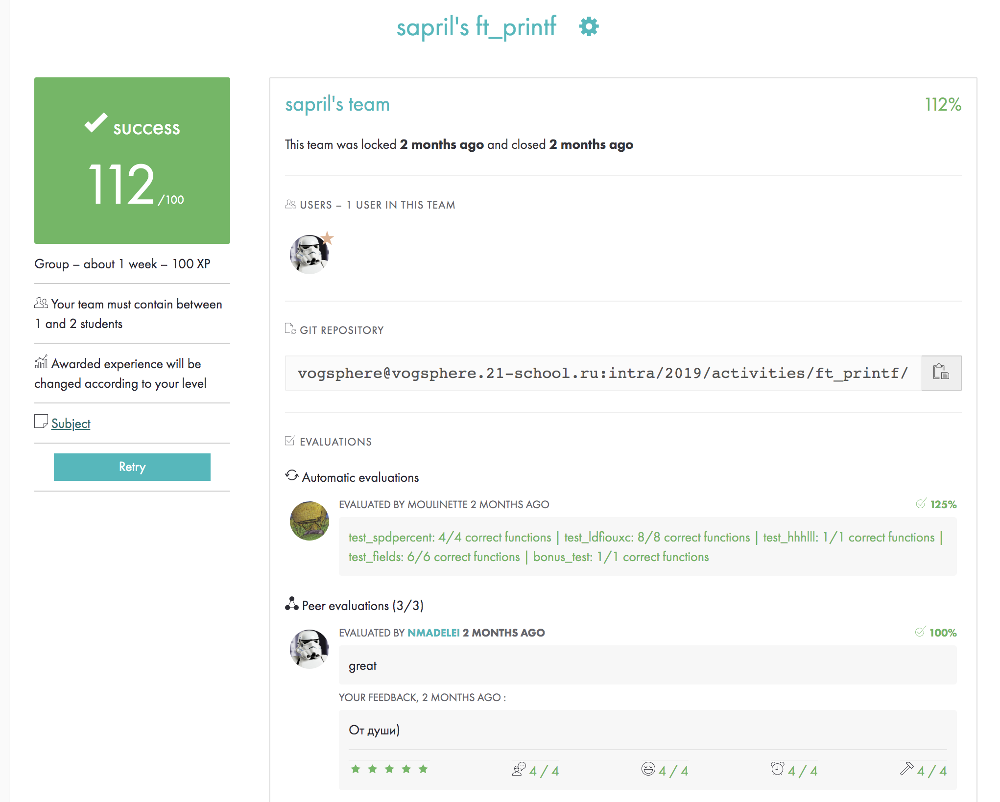

# ft_printf
### Score 112/100
##### Mandatory
100/100
##### Bonus
12/25

***
## How to run
```console
git clone https://github.com/Severno/ft_printf
cd ft_printf
make
gcc -Wall -Werror -Wextra main.c libftprintf.a -o run
./run
```

### Challenge
To recode libc's `printf`.  
  
At 21, students are not allowed to use library functions. We can only submit wholly self-written functions (no `strlen`, `strdup`, `bzero` etc.).
ft_printf must be formatted in the same manor as libc's `printf`. For example:
```c
ft_printf("%s is a %d student\n", "Artem", 21);
printf("%s is a %d student\n", "Artem", 21);
```
Should give back:
```console
Artem is a 21 student
Artem is a 21 student
```
  
The project is complicated as the number of parameters is indefinite. We use variadic arguments in this case.  
  
**ft_printf **must achieve the following mandatory requirements:  
  
* Manage the following conversions: `s`, `S`, `p`, `d`, `D`, `i`, `o`, `O`, `u`, `U`, `x`, `X`, `c`, `C`, `f` & `F`
* Manage `%%`
* Manage the flags `#`, `0`, `-`, `+` & `space`
* Manage the minimum field-width
* Manage the precision
* Manage the flags `hh`, `h`, `l`, `ll`, `j`, & `z`.
  
The function must conform to 21's norm.  
The function cannot leak. All errors must be handled carefully. In no way can the function quit in an unexpected manner (Segmentation fault, bus error, double free, etc).  
Allowed functions are `write`, `getloacale`, `malloc`, `free`, `exit` and the three functions of `stdarg`. Everything else is forbidden.
***
### Using the project
To compile, run `make`. This will compile **libftprintf.a**. To use, include `ft_printf.h` (located inside includes directory) and use just like `printf`:
```c
#include "ft_printf.h"

int				main(void)
{
	ft_printf("%s, %s!\n", "Hello", "world");
	return (0);
}
```
Then compile with a program:
```console
gcc -Wall -Werror -Wextra main.c libftprintf.a -o run; ./run
```
Special thank to @davhojt


### HAVE FUN :))
